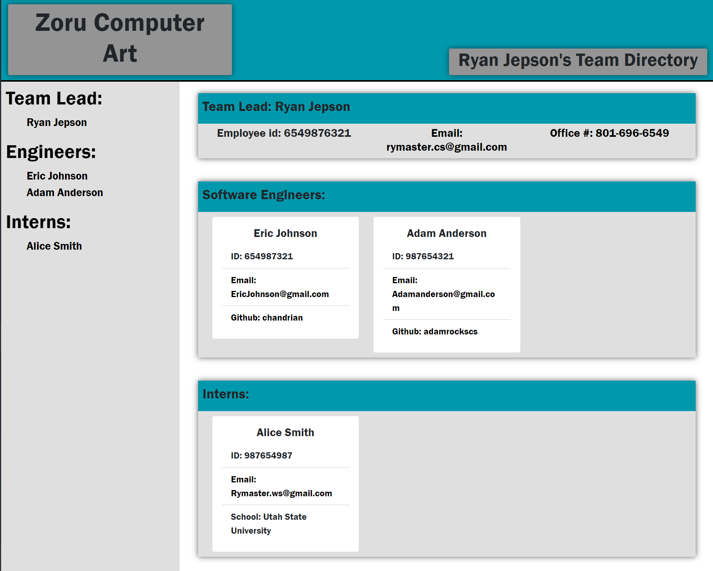

# Team Profile Generator
##  Description
Welcome to Team Profile Generator! This application creates a basic webpage that will display the names, employee id's, emails, and other applicable information about your team leads and their employees. The web page will consist of 4 sections: The table of contents, Information about your Team Lead, information about all of your software engineers, and information about all your interns. The Application is simple to use and easily expandable. 

## Table of Contents:
* [Installation](#installation)
* [Usage](#usage)
* [Contributions](#contributions)
* [Testing](#testing)
* [License](#license)
* [Questions](#questions)

## Installation
In order to install the project you will need to download all the files in this repository, put the files in to any directory you would like. Once you have extracted the files from the zip folder you will need to open a command line terminal in that upper most directory (this directory will contain the app.js file). In order to run this you will need to have Node.js installed. In the command line first type 'npm install' or just 'npm i'. After that You have installed the application! Easy right?

## Usage
To use the Team Profile Generator, after installation type 'node app.js' into your terminal. Then Follow the prompts on your screen. NOTE: what ever you enter into the terminal for each answer will be what displays on the website so make sure to use capital letters and check spelling errors when needed. Once you have gone through all the prompts navigate to the src/dev directory. Your html page and CSS will be waiting for you.
## Image:

        

## Contributions
If you would like to contribute to this project, please follow the guidelines below:
You May Use this project as you wish, but if you do not modify the code very much please give me credit (ryma1738).

## Testing
To test to make sure you install the project correctly you can install the dev tools from npm and run npm test to make sure it is working.

## Video Link
[[Video Link]](https://youtu.be/b_0bRX8coBY)

## License

© Ryan Jepson, Zoru
Licensed under the [MIT License](LICENSE)
        

## Questions
GitHub: [ryma1738](https://github.com/ryma1738) 
Email: <rymaster.cs@gmail.com>
